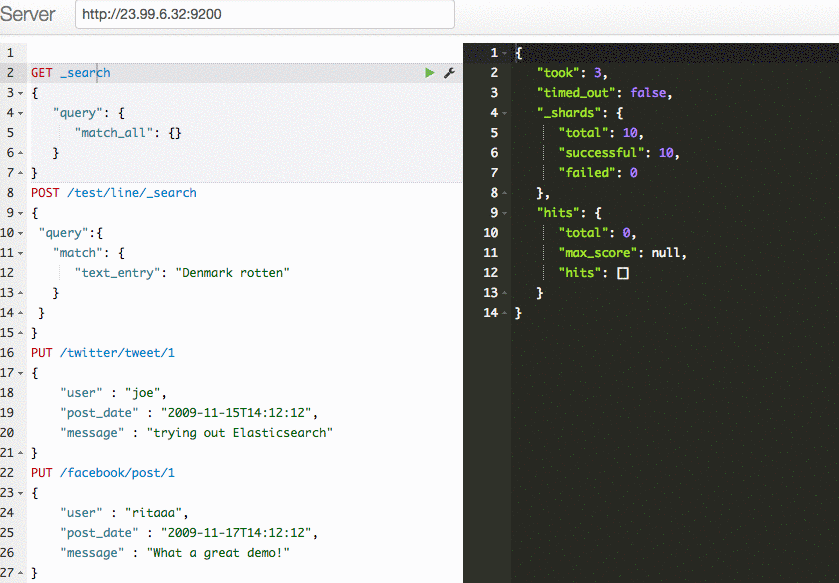

# Deployment of an ElasticSearch cluster on Azure using SaltStack

[SaltStack](https://github.com/saltstack/salt) is an Open Source project that aims to deliver infrastructure as code and configuration management with abstraction of the cloud provider selected. This repo is an end-to-end example of provisioning an ElasticSearch cluster on Azure using SaltStack configurations.

> :triangular_flag_on_post: NOTE: The support of Azure ARM by SaltStack is still in preview. The documentation is non-existent and a lot of the configuration settings had to be done by experimentation and reading the code. Hope this repo serves as both an example as well as documentation.

## Overview
The model of SaltStack is based on master and minions with each minion agent reaching back to the master; this makes the solution very scalable. The master holds the configuration of the minions in a set of configuration files. Those files provide an idempotent configuration that will be applied when the minion role is deployed or at any time the configuration is re-applied. You can also refer to [this case study](https://www.microsoft.com/reallifecode/2017/05/09/provision-configure-infrastructure-azure-using-saltstack/) for more details about this sample.

## Installation
Clone this repo:

    git clone https://github.com/ritazh/azure-saltstack-elasticsearch

Get Azure CLI 2.0 [here](https://docs.microsoft.com/en-us/cli/azure/install-azure-cli) if you don't already have it. Then log into the CLI:
	
	az login
	az account show

Now create a service principal, following [these steps](https://docs.microsoft.com/en-us/cli/azure/create-an-azure-service-principal-azure-cli).

The output should look somehing like the following:
```
{
  "appId": "59db508a-3429-4094-a828-e8b4680fc790",
  "displayName": "myserviceprincipalapp",
  "name": "https://myserviceprincipalapp.azurewebsites.net",
  "password": {the password you supplied displayed here},
  "tenant": "72f988bf-86f1-41af-91ab-2d7cd011db47"
}

```

Now you are ready to kickoff the scripts. Use `appId` from previous step for `servicePrincipalAppId` and `password` from previous step for serviceprincipalsecret`.  Now, sit back and enjoy a cup of coffee. (This might take awhile.) Once the script is done, you will have a working ElasticSearch cluster ready to be used. 
  	
  	deploy-salt-cluster.sh -o create -u <adminUsernameForVM> -n <namespaceForResourceGroup> -c <servicePrincipalAppId> -s <serviceprincipalsecret> -t <tenantid>

After the script is done, look for the IP address of the `minionesmaster` node from the Azure portal, use this IP to query and add new content to your search index. 



## Acknowledgement
Many thanks to [@baronomasia](https://github.com/baronomasia) for helping me troubleshoot Salt configurations and making it all come together.


